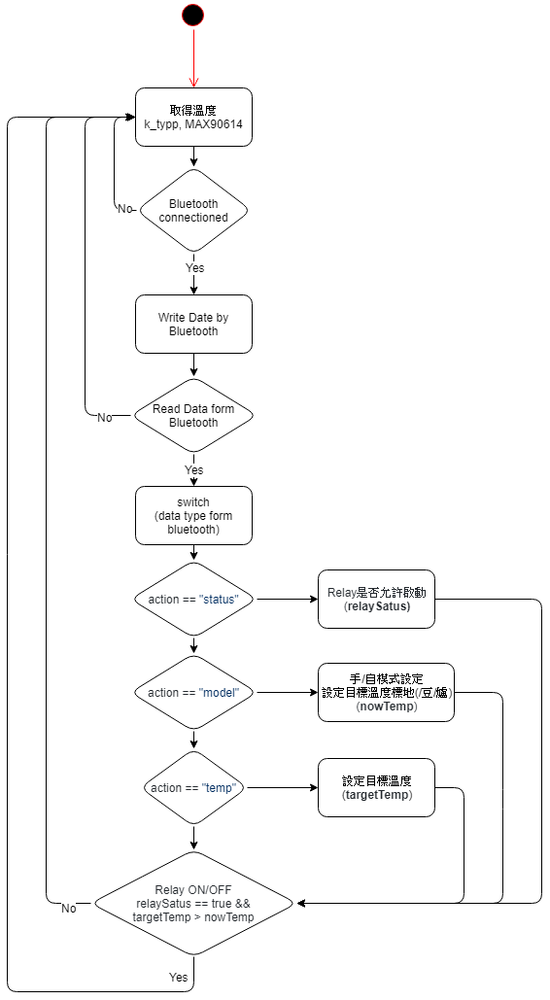
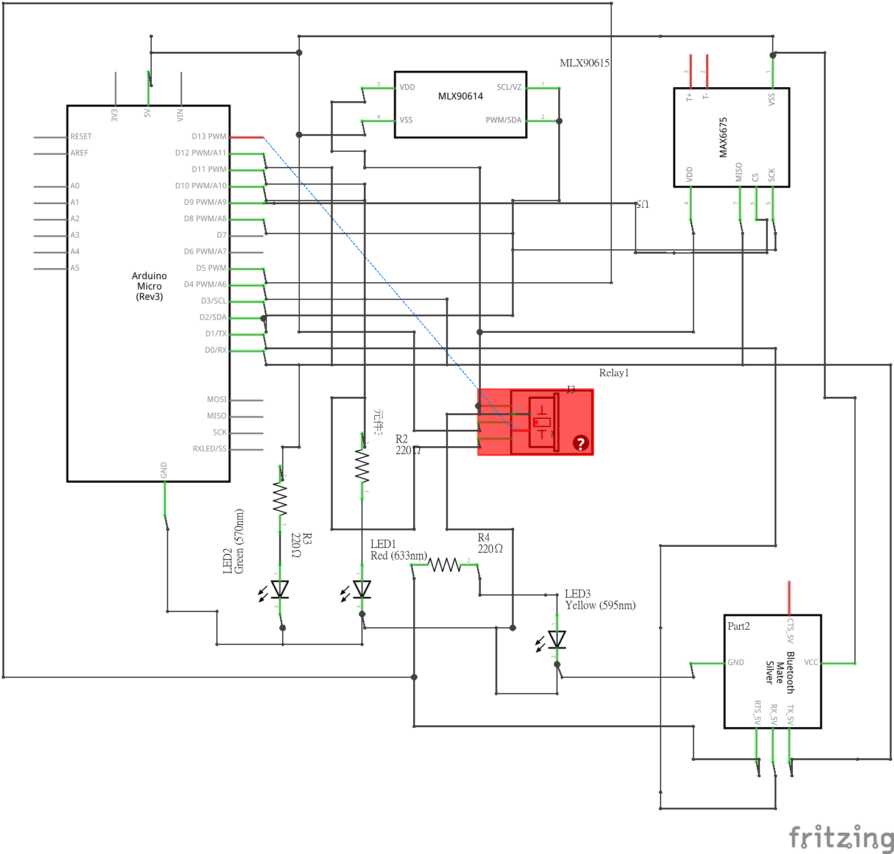

# CoffeeBeansLife of Arduino

## 流程圖

## 使用相關硬體與元件

 Item | describe |
 -------|---------
  Arduino misco | 微控制器主板 |
  HC-05 | 藍芽模組
  MAX6675 | K型電熱偶感溫模組 |
  MLX9614(5V) | 非接觸紅外線感溫模組 |
  Buzzer | 蜂鳴器，顯示藍芽連線狀態 |
  LED RED | 系統狀態，ON：硬體裝置開始運行|
  LED GREEN | Relay否允許啟動，ON：允許可以透過溫度設定繼電器開關, OFF: 繼電器不允許啟動 |
  LED YELLOW | 顯示藍芽連線狀態，ON：裝置連線中, OFF: 未有裝置連線 |
  SRD(5v) | 電磁式 繼電器 |

## 電路圖

**電路接線**

**電路架構圖**

>MAX6675 晶片腳位如下圖

>MLX90614 晶片腳位如下圖

## Arduino misco與相關傳感器連接腳位

### MLX90614

   Arduino Pin   |   Sensor Pin   |
---------------- | -------------- |
 D2 | MLX90614_SDA |
 D3 | MLX90614_SCL |
 5v | MLX90614_Vdd |
 GND | MLX90614_Vss |

### SRD

   Arduino Pin   |   Sensor Pin   |
---------------- | -------------- |
 D4 | SRD_IN |
 5v | SRD_VCC |
 GND | SRD_GND |

### HC-05

   Arduino Pin   |   Sensor Pin   |
---------------- | -------------- |
 D5 | HC-05_SCK |
 TX | HC-05_RX |
 RX | HC-05_TX |
 5V | HC-05_VVV |
 GND | HC-05_GND |

## MAX6675

   Arduino Pin   |   Sensor Pin   |
---------------- | -------------- |
 D8 | MAX6675_SCK |
 D9 | MAX6675_CS |
 D10 | MAX6675_SO |
 5V | MAX6675_VCC |
 GND | MAX6675_GND |

## LED

   Arduino Pin   |   Sensor Pin   |
---------------- | -------------- |
 D5 | LED **YELLOW** +|
 GND | LED **YELLOW** GDN |
 D11 | LED **RED** +|
 GND | LED **RED** GND |
 D12 | LED **GREEN** +|
 GND | LED **GREEN** GDN |
